<p align="center">
  
</p>

<p align="center">
  <a href="https://affansayed.vercel.app/">
    
  </a>
</p>

<p align="center">
  <a href="https://affansayed.vercel.app/"></a>
  <a href="mailto:aaaffansayed@gmail.com"></a>
  <a href="https://linkedin.com/in/sayedaffan"></a>
  
</p>

<p align="center">
  <a href="#-system-diagnostic--security-specification"><code>[ 📟 Diagnostic ]</code></a> •
  <a href="#-security-operations--github-telemetry"><code>[ 📊 Telemetry ]</code></a> •
  <a href="#-cybersecurity-platforms--ctf-training"><code>[ 🚩 CTF & Training ]</code></a> •
  <a href="#-tech-stack--toolkit"><code>[ 💻 Tech Stack ]</code></a> •
  <a href="#-interactive-security-lab--architecture"><code>[ 🔬 HomeLab ]</code></a> •
  <a href="#-featured-projects--codebases"><code>[ 🛡️ Projects ]</code></a> •
  <a href="#-connect--collaborate"><code>[ 📫 Connect ]</code></a>
</p>

---

## 📟 System Diagnostic & Security Specification

<p align="center">
  
</p>

---

## 📊 Security Operations & GitHub Telemetry

<p align="center">
  
</p>

<p align="center">
  <a href="https://github.com/sayedaffan1">
    
  </a>
  <a href="https://github.com/sayedaffan1">
    
  </a>
</p>

<p align="center">
  <a href="https://github.com/sayedaffan1">
    
  </a>
</p>

---

## 🐍 Contribution Grid Activity

<p align="center">
  <picture>
    <source media="(prefers-color-scheme: dark)" srcset="https://raw.githubusercontent.com/sayedaffan1/sayedaffan1/output/github-contribution-grid-snake-dark.svg">
    <source media="(prefers-color-scheme: light)" srcset="https://raw.githubusercontent.com/sayedaffan1/sayedaffan1/output/github-contribution-grid-snake.svg">
    
  </picture>
</p>

---

## 🚩 Cybersecurity Platforms & CTF Training

<p align="center">
  <a href="https://tryhackme.com"></a>
  <a href="https://hackthebox.com"></a>
  <a href="https://portswigger.net/web-security"></a>
  <a href="https://owasp.org"></a>
</p>

---

## 💻 Tech Stack & Toolkit

### 🛡️ Cybersecurity & Ethical Hacking
<p>
  
  
  
  
  
  
  
  
  
  
  
  
  
</p>

### 🌐 Networking & Infrastructure
<p>
  
  
  
  
  
  
  
  
  
  
  
  
</p>

### 💻 IT Support, Operating Systems & Administration
<p>
  
  
  
  
  
  
  
  
  
</p>

### ☁️ Cloud, Virtualization & Containers
<p>
  
  
  
  
  
  
</p>

### 🛠️ Languages & Web Development
<p>
  
  
  
  
  
  
  
  
  
  
  
</p>

---

## 🔬 Interactive Security Lab & Architecture

<details>
  <summary><b>🖥️ Click to View Virtualized Defense & HomeLab Architecture</b></summary>
  <br/>
  
  ```yaml
  HomeLab Infrastructure:
    Hypervisors: [VMware Workstation Pro, Oracle VirtualBox]
    Attack & Testing:
      - Kali Linux (Penetration testing, OSINT, Metasploit, Burp Suite, Nmap)
    Defensive & Enterprise Services:
      - Windows Server 2022 (Domain Controller, Active Directory DS, DNS, DHCP, GPO)
      - pfSense / OPNsense Firewall (VLAN segmentation, NAT, Snort IDS/IPS)
    Network Architecture:
      - Segmented Subnets: Management (10.0.10.0/24), Internal Servers (10.0.20.0/24), DMZ (10.0.30.0/24)
      - Secure Remote Access: OpenVPN with certificate-based auth + 2FA
    Telemetry & Monitoring:
      - Packet Analysis: Wireshark SPAN port mirroring
      - Hardening: Linux iptables, Windows Group Policies, CIS Benchmarks
  ```
</details>

<details>
  <summary><b>📜 Click to View Security & Certifications Roadmap</b></summary>
  <br/>
  
  * 🎯 **CompTIA Security+ / Network+** — *Core Network & Enterprise Security Foundations*
  * 🛡️ **eJPT (eLearnSecurity Junior Penetration Tester)** — *Hands-on Penetration Testing & Vulnerability Assessment*
  * 🌐 **Cisco CCNA (200-301)** — *Enterprise Routing, Switching, IP Services & Automation*
  * 🐍 **Python for Offensive & Defensive Security** — *Custom Socket Sniffers, Port Scanners, Automated Exploit Proof-of-Concepts*
</details>

---

## 🛡️ Featured Projects & Codebases

<table>
  <tr>
    <td width="50%" valign="top">
      <h3>🛡️ Secure Remote Access Solution</h3>
      <p>Hardened enterprise remote connectivity infrastructure utilizing OpenVPN, Multi-Factor Authentication (MFA), endpoint posture checks, and firewall segmentation rules.</p>
      <p>
        
        
        
        
      </p>
    </td>
    <td width="50%" valign="top">
      <h3>🔑 Secure Password Manager</h3>
      <p>Robust encrypted credential management vault utilizing strong master key derivation (PBKDF2/Argon2), AES-256 GCM encryption, and local zero-knowledge storage.</p>
      <p>
        
        
        
        
      </p>
    </td>
  </tr>
  <tr>
    <td width="50%" valign="top">
      <h3>🏋️ <a href="https://github.com/sayedaffan1/GYM-management-system">GYM Management System</a></h3>
      <p>Full-featured management platform for membership tracking, subscription scheduling, and administration workflows.</p>
      <p>
        
        
      </p>
    </td>
    <td width="50%" valign="top">
      <h3>🌐 <a href="https://github.com/sayedaffan1/Portfolio">Personal Portfolio & Showcase</a></h3>
      <p>Interactive web application showcasing projects, cyber tools, technical skills, and background.</p>
      <p>
        
        
      </p>
    </td>
  </tr>
</table>

---

## 🔐 Cybersecurity Directive

```bash
┌──[ defense@affansayed:~ ]
└──$ cat << 'EOF'
"Security is not a product, but a continuous process.
Defend with precision, verify every request, and assume zero trust."
EOF
```

---

<p align="center" id="-connect--collaborate">
  <b>Let's build and secure resilient systems together!</b><br/>
  Feel free to reach out for collaborations, discussions, or technical projects.
</p>

<p align="center">
  <a href="https://affansayed.vercel.app/"></a>
  <a href="mailto:aaaffansayed@gmail.com"></a>
  <a href="https://linkedin.com/in/sayedaffan"></a>
</p>
