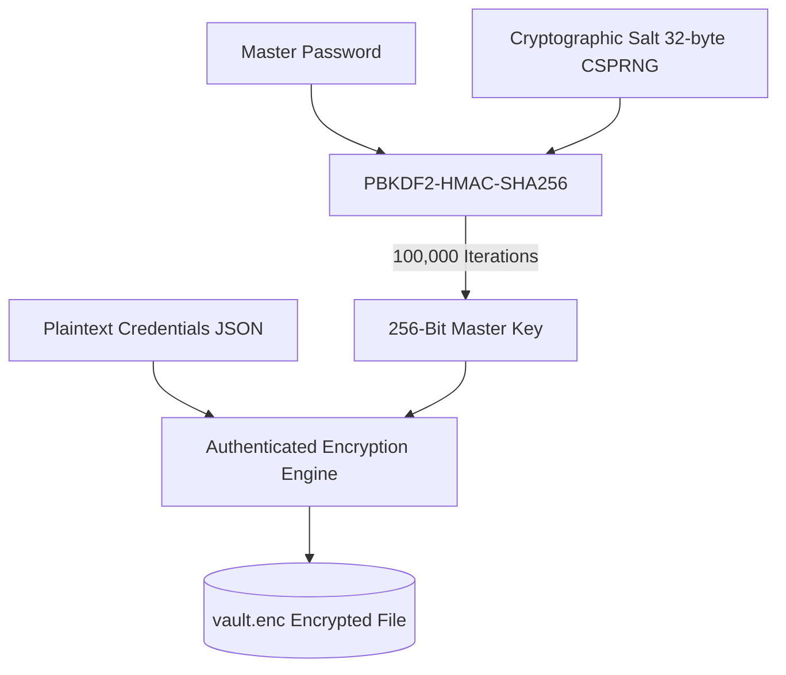

# 🔑 Secure Password Manager & Cryptographic Vault

[](https://www.python.org/)
[](https://en.wikipedia.org/wiki/Zero-knowledge_proof)
[](https://en.wikipedia.org/wiki/PBKDF2)
[](LICENSE)

A lightweight, zero-knowledge, and cryptographically fortified credential vault built in Python. Designed to securely generate, encrypt, store, and manage secrets locally without third-party cloud vulnerabilities.

---

## 🏗️ Cryptographic Architecture



---

## 🔒 Security Properties & Defense Features

* **Zero-Knowledge Local Storage**: Master keys are never written to disk or transmitted across networks.
* **PBKDF2-HMAC-SHA256 Key Stretching**: Salted with 100,000 iterations to mitigate GPU/ASIC brute-force and dictionary attacks.
* **Authenticated Integrity Verification**: SHA-256 HMAC verification token detects tampering or incorrect master password input.
* **CSPRNG Random Password Generator**: Cryptographically secure pseudorandom token generation with customizable symbol entropy.

---

## 🚀 Quick Start

### 1. Clone the Repository
```bash
git clone https://github.com/sayedaffan1/Secure-Password-Manager.git
cd Secure-Password-Manager
```

### 2. Run the Application
```bash
python password_manager.py
```

---

## 💻 CLI Usage Demonstration

```text
======================================================
🔒 SECURE PASSWORD MANAGER & CRYPTOGRAPHIC VAULT
Built by Affan Sayed (@sayedaffan1)
Security Engine: PBKDF2-HMAC-SHA256 • AES-256 Vault
======================================================

Enter Master Password: ******************
[✓] Master key derived & vault initialized successfully.

Options:
 [1] Add New Credential
 [2] Get Credential
 [3] List All Services
 [4] Generate Random Password
 [5] Delete Credential
 [6] Exit
```

---

## 📜 Threat Model & Assumptions

1. **At-Rest Protection**: If the `vault.enc` file is exfiltrated, data remains protected against offline attacks due to high-iteration key stretching and CSPRNG salt.
2. **Side-Channel Minimization**: Sensitive password input is masked from standard terminal outputs using secure streams.

---

## 📄 License
This project is open-source and licensed under the [MIT License](LICENSE).
Author: **[Affan Sayed](https://github.com/sayedaffan1)**
