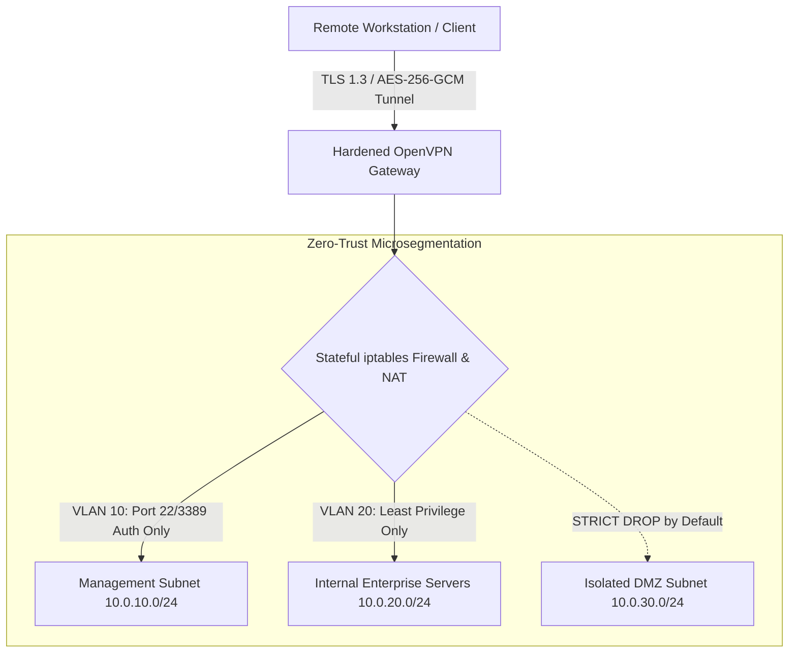

# 🛡️ Hardened Secure Remote Access & Zero-Trust VPN Infrastructure

[](https://openvpn.net/)
[](https://www.nist.gov/publications/zero-trust-architecture)
[](https://en.wikipedia.org/wiki/Galois/Counter_Mode)
[](https://netfilter.org/)

An enterprise-hardened, zero-trust remote access architecture implementing multi-factor certificate authentication, strict subnet isolation, TLS 1.3 cryptographic handshakes, and automated client certificate lifecycle management.

---

## 🌐 Network Defense Topology



---

## 🔒 Hardened Security Controls

* **Cipher Suite**: `AES-256-GCM` authenticated symmetric encryption.
* **Key Exchange & Forward Secrecy**: Diffie-Hellman 4096-bit parameters with `TLS-Crypt-v2` packet authentication.
* **Subnet Micro-segmentation**: `iptables` rules restrict remote workers strictly to designated application ports (Least Privilege).
* **Killswitch & DNS Leak Protection**: Server pushes `redirect-gateway def1` and hardened resolver configurations.

---

## 🚀 Quick Deployment Guide

### 1. Firewall & Routing Hardening
Execute the network setup script on the Linux gateway server:
```bash
chmod +x setup_firewall.sh
sudo ./setup_firewall.sh
```

### 2. Generate Client Certificate Profile
Automate certificate provisioning and export a single unified `.ovpn` configuration:
```bash
chmod +x generate_client.sh
sudo ./generate_client.sh engineering-workstation-01
```

---

## 📁 Repository Structure
```text
├── server.conf                # Hardened OpenVPN server configuration
├── client.ovpn.template       # Unified secure client configuration template
├── setup_firewall.sh          # Linux iptables routing & subnet isolation automation
├── generate_client.sh         # PKI cert generation and client profile packager
├── README.md                  # Comprehensive architecture and security guide
└── .gitignore                 # Excludes raw private keys (*.key, *.crt)
```

---

## 📄 License & Attribution
Maintained by **[Affan Sayed](https://github.com/sayedaffan1)** under the [MIT License](LICENSE).
